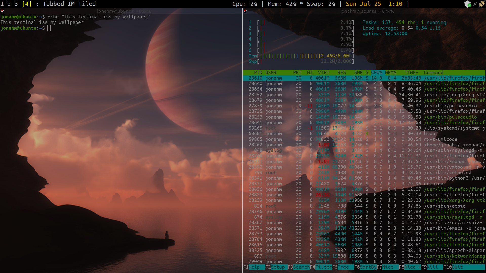
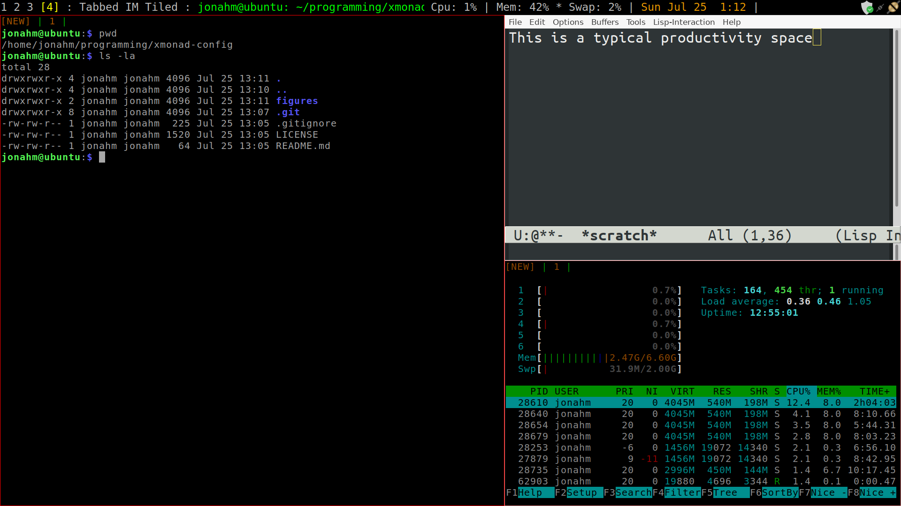

xmonad-config
===

These are instructions for setting up `xmonad` the way I do. Here's
what my most recent desktop looks like:

## What is xmonad?

[xmonad](https://xmonad.org/) is a [tiling window
manager](https://en.wikipedia.org/wiki/Tiling_window_manager),
primarily for unix based operating systems. This means that, rather
than dragging and dropping your windows like in the eponymous
operating system, windows are arranged automatically. When you open a
new program on an empty screen, it fills the whole screen. You add a
new program? The screen splits in two, etc. The way the windows are
arranged is then controlled by hotkey combinations on your
keyboard. It's a different way of interacting with your computer. And,
although there's a learning curve, it makes things very fast and
seamless once you're used to it. I've been using tiling windows
managers for over a decade now and I'm never going back.

`xmonad` is a particular tiling window manager written and configured
in [Haskell](https://www.haskell.org/), the famous functional
programming language. For fans of Haskell, like myself, this is
obviously a plus. However, you don't need to know Haskell to configure
xmonad. The biggest advantage of `xmonad` being configured in Haskell
is that it's turing complete and very very extensible.

`xmonad` has a reputation for being excellent with multiple monitors
as well. This is true, but I won't get in to it here.

## Why use this configuration?

My configuration is, of course, idiosyncratic and designed for
me. That said, you may find some gems in here that you'd enjoy. Here
are some of the aspects of my configuration I'm proud of:

- Behind all windows is a transparent terminal. In essence, my
  wallpaper *is* a terminal, which you can interact with.

- My wallpaper cycles once an hour, randomly without repeats. This is
  obviously a feature you can get in other environments, but it's not
  automatic to mimic in `xmonad`.

- I have emacs running in client-server mode, which means I can
  instantly summon an emacs window with a hotkey, and emacs remembers
  everything I've been doing with it. Startup is also very fast, as
  the emacs daemon is always running in the background.
  
- I integrate custom background processes, like the emacs daemon with
  `systemd` so that they automatically start when you enter `xmonad`.

- I have a fairly nice configuration for the lightweight terminal
  emulator, `rxvt-unicode`.
  
## Why not use this configuration?

You might want to explore these things youreself and come up with a
desktop environment that works for you. Or, you may want to use the
[Wayland](https://wayland.freedesktop.org/) compositor for Linux,
which replaces X11. Unfortunately, xmonad appears unlikely to ever
adapt and become compatible with Wayland. If that's important to you,
here are some tiling window managers that *do* work with Wayland that
you may want to check out:

- [Waymonad](https://github.com/waymonad/waymonad) is a port of xmonad
  to Wayland. Unfortunately the project appears dead.
  
- [Sway](https://swaywm.org/) is a port of the popular
  [i3](https://i3wm.org/) tiling window manager to Wayland. Sway is
  under active development.

- [PaperWM](https://github.com/paperwm/PaperWM) is a very interesting
  take on tiling windows managers built on top of the Gnome 3 shell.

## Prerequisites

These instructions assume you're running [Ubuntu](https://ubuntu.com/)
desktop. Most recently tested on Ubuntu 20 LTS. That said, they should
work, with minor changes, for most Linux distributions.

## Repository Organization

This repository is organized as follows:

- The `instructions` directory contains markdown files explaining what
  to do for various self-contained pieces of the configuration. The
  files are numbered, and I link to them below, with descriptions, but
  you should feel free to jump around as you like.
  
- The `scripts` directory contains scripts used in the configuration.

- The `dotfiles` directory contains configuration files. Since many
  configuration files are hidden by default, I use the following
  naming convention instead of the leading `.`. I name files with the
  directory containing them, separated by `.`. So for example, a
  `.bashrc` file would be listed as `home.bashrc`. A file that lives
  in `~/.config/systemd/user` might be named
  `home.config.systemd.user.emacs.service`.

## Table of contents

The instrutions available are:

- [01-installing-xmonad](instructions/01-installing-xmonad.md)
  describes the basics of installing `xmonad`.
- [02-configuring-xmonad](instructions/02-configuring-xmonad.md)
  describes key details of configuring `xmonad`. It highlights any
  significant differences in hotkeys/capabilities that my config has
  over normal ones.
- [03-configuring-cycle-wallpaper](instructions/03-configuring-cycle-wallpaper.md)
  describes how to configure my slideshow wallpaper script.
- [04-configuring-bash](instructions/configuring-bash.md) describes my bashrc
- [04-configuring-extras](instructions/04-configuring-extras.md)
  describes how to configure my terminal editor, emacs, bashrc, and
  systemd.

## Contact

If you find issues please feel free to reach out via github issues.
