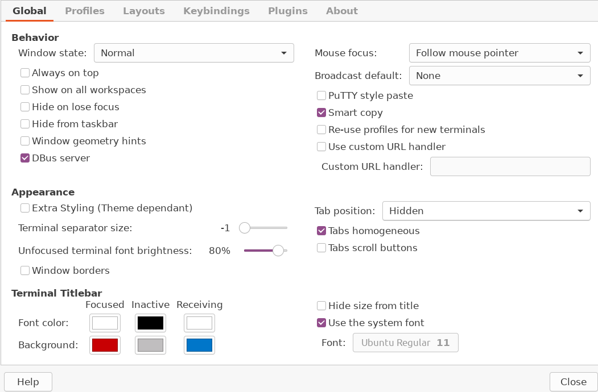
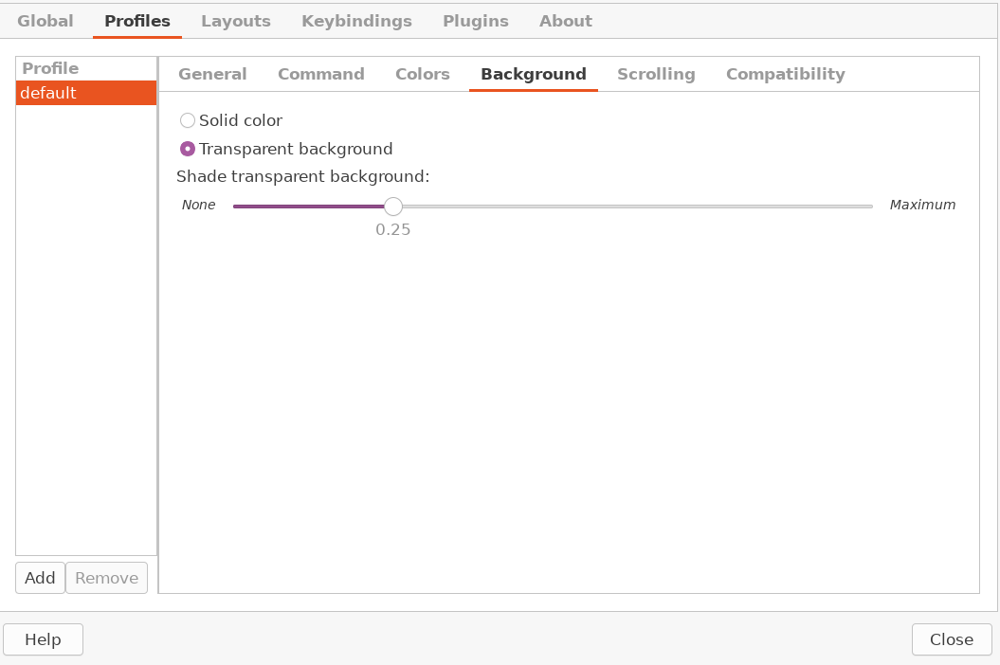

Configuring xmonad
===

## The Basics

Xmonad is configured in `.xmonad/xmonad.hs`. You can get my
configuration by copying it out of `dotfiles`:
```bash
mkdir -p ~/.xmonad
cp dotfiles/home.xmonad.xmonad.hs ~/.xmonad/xmonad.hs
```

My configuration is mostly the [stock
configuration](https://github.com/xmonad/xmonad/blob/master/TUTORIAL.md)
with a few modifications:
- I have modified some of the default programs and hotkeys
- I call an autostart script

### Hotkeys

Hotkeys in xmonad are set via a list like:
```haskell
myKeys conf@(XConfig {XMonad.modMask = modm}) = M.fromList $
  [ item1, item2, ..., ]
```
where each item looks like, e.g., 
```haskell
    -- close focused window
    ((modm .|. shiftMask, xK_c     ), kill)
```
where `modm` is `mod4`, usually the Windows or command key, 
`shiftMask` is shift, and `xK_c` is the letter "c" on your keyboard. 
So this is conbination is Windows+Shift+C. 

The main changes I have made are:
```haskell
-- mod-o move to workspace to the right
    -- mod-i move to workspace to the left
    -- mod-Shift-O move focussed window to workspace to the right
    -- mod-Shift-I move focussed window to the workspace to the left
    , ((modm, xK_o               ), nextWS)
    , ((modm, xK_i               ), prevWS)
    , ((modm .|. shiftMask, xK_o ), shiftToNext >> nextWS)
    , ((modm .|. shiftMask, xK_i ), shiftToPrev >> prevWS)
```
which allow you to move between virtual desktops with the "I" and "O" keys on the keyboard. 
`Win+i` and `Win+o` move one workspace left or right. 
Add shift, and you drag the current window you're working on with you.

### Different terminal editor
```haskell
-- The preferred terminal program, which is used in a binding below and by
-- certain contrib modules.
--
myTerminal = "rxvt-unicode"
```
means I've replaced the default terminal emulator with `rxvt-unicode`. 
To see how to configure this terminal emulator, 
see [04-configuring-extras](04-configuring-extras.md).

### Manage Hooks
```haskell
------------------------------------------------------------------------
-- Window rules:

-- Execute arbitrary actions and WindowSet manipulations when managing
-- a new window. You can use this to, for example, always float a
-- particular program, or have a client always appear on a particular
-- workspace.
--
-- To find the property name associated with a program, use
-- > xprop | grep WM_CLASS
-- and click on the client you're interested in.
--
-- To match on the WM_NAME, you can use 'title' in the same way that
-- 'className' and 'resource' are used below.
--
-- The doFloat command is super useful It tells Xmonad to respect the
-- geometry of the window, and ignore it with respect to the
-- tiling. The issue is it is always above the other windows. Useful
-- for some things, I suppose, but I find it pretty annoying.
--
myManageHook = composeAll
    [ className =? "MPlayer"        --> doFloat -- make mplayers window float
    , className =? "Gimp"           --> doFloat -- Make gimp's windows float
    , resource  =? "desktop_window" --> doIgnore -- There is no desktop
    , resource  =? "kdesktop"       --> doIgnore  -- There is no desktop
    , className =? "Firefox" <&&> resource =? "Dialog" --> doFloat 
    , className =? "Terminator" --> doF W.swapDown >> doIgnore -- make terminator a background thing 
    , className =? "Pidgin" --> doShift "9" -- send Pidgin to WS 9
    , className =? "Evolution" --> doShift "8" -- send Thunderbird to WS 8
    ]
```
which do various things `doFloat` makes a window floating rather than tiled. 
This is useful for things like status windows or error messages. 
`doIgnore` is more extreme. It means the window can't be created or deleted.
This is useful for thengs like system trays and status bars. `doShift`
moves a window to a specific virtual desktop. In this case, I put my chat program,
Pidgin, and my email program `Evolution` on desktops 9 and 8 respectively.
Finally, `swapDown` makes the window floating and moves it behind the other windows.

The most interesting command here is this one:
```haskell
    , className =? "Terminator" --> doF W.swapDown >> doIgnore -- make terminator a background thing 
```
This is part of my "terminal wallpaper" setup. 
The program `terminator` is a very powerful, configurable terminal editor.
This command moves it behind everything else and stops managing it, which lets us 
make it live in the background behind all the other windows.

### Startup Hooks
```haskell
------------------------------------------------------------------------
-- Startup hook

-- Perform an arbitrary action each time xmonad starts or is restarted
-- with mod-q.  Used by, e.g., XMonad.Layout.PerWorkspace to initialize
-- per-workspace layout choices.
--
-- By default, do nothing.
-- Runs a bunch of programs we want.
-- myStartupHook = return () -- setWMName "LG3D" -- Trick Java into working correctly
myStartupHook :: X()
myStartupHook = do
  -- setWMName "LG3D" -- Tricks Java into working correctly
  spawn "/home/jonahm/.xmonad/autostart" -- runs my startup programs
```
calls the program in `dotfiles/home.xmonad.autostart`, which you can enable with
```bash
cp dotfiles/home.xmonad.autostart ~/.xmonad/autostart
```
Tis will be described in more detail below.

### Important note

Be sure to find-replace all instances of my username `jonahm` with your username.

## xmobar

`xmobar` is the status bar used by `xmnad`. You can get my configuration by running
```bash
cp dotfiles/home.xmobarrc ~/.xmobarrc
```
You may wish to tweak this line:
```
font = "xft:DejaVuSansMono:size=14"
```
which sets the font size (you of course need this font installed), 
and this one:
```
       , position = TopW L 85
```
which says xmobar takes up 85% of the screen starting on the left.

## Autostart

The autostart script has a few important lines. I will go over them
one after the other:

### xsetroot

This line
```bash
# Produces the expected left curser
xsetroot -cursor_name left_ptr
```
ensures the cursor is an arrow and not some other strange symbol.

### xmodmap

This line adds the "menu" key if you have one as an additional "Windows" key:
```bash
# Add the menu key to the mod4 list
xmodmap -e "add Mod4 = Menu"
```

### compton

This line enables things like transparencies by running the compositor.
```bash
# Starts the compositing manager
if [[ -z "$(pgrep compton)" ]]; then
    compton &
fi
```

### System Tray

This line sets up the system tray, which we downloaded. This is the `trayer` program.
```bash
# Set up an icon tray
if [[ -z "$(pgrep trayer)" ]]; then
    trayer --edge top --align right --SetDockType true --SetPartialStrut true --expand true --width 15 --transparent true --tint 0x000000 --alpha 0 --height 32 &
fi
```
Trayer can mostly be left alone, but you may wish to control the width and height arguments. 
The width is percent of the screen. (Trayer lives on the top right.) The height is in pixels.
It takes me some experimentation to get this right, as it depends on the screen size you have
and the font size of `xmobar` and size of your sybmols. 
With everything set up correctly, xmobar + trayer should be a uniform 
black bar at the top of your screen.

### Terminator

This line is the second piece of the transparent terminal wallpaper:
```bash
# Starts a background terminal w/ tabbed htop
if [[ -z "$(pgrep terminator)" ]]; then
    terminator -b --geometry=1920x1048+0+32 &
fi
```
This starts `terminator` with a window shape of (in this example) 1920x1048 pixels.
The `+0+32` means it's shifted down from the top of the screen by 32 pixels, 
so it doesn't overlap with xmobar/trayer. Again, this takes some experimentation
to get right. Try experimenting and seeing what geometry fits your screen best.

Once you start up terminator for the first time, you will want to right-click it 
anywhere and go into preferences. 
There you want to disable the side scrollbar and enable transparency, 
as shown in these screenshots:





### Non-reparentying

Java based programs can cause stuttering in xmonad. These environment
variables help with this issue:
```bash
# Tells Java that Xmonad is non-reparenting
_JAVA_AWT_WM_NONREPARENTING=1
export _JAVA_AWT_WM_NONREPARENTING
wmname LG3D
```
